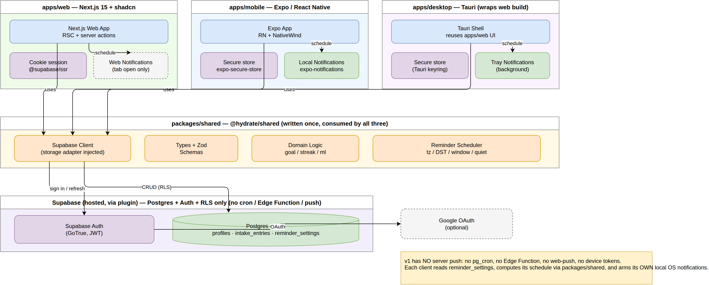

# Hydrate

A multiplatform water tracker & reminder app — native mobile (iOS + Android), web, and desktop — with on-device local-notification reminders and a hosted Supabase backend.

> **Status: planning.** No app code yet — this repo currently holds the implementation plan and architecture diagrams.

## Plan

See **[docs/PLAN.md](docs/PLAN.md)** for the full implementation plan: stack, monorepo layout, data model, auth, reminder scheduling, and the M0–M10 build roadmap.

## Diagrams

| Diagram             |                                                                                                         |
| ------------------- | ------------------------------------------------------------------------------------------------------- |
| Architecture        | [svg](docs/diagrams/01-architecture.svg) · [drawio](docs/diagrams/01-architecture.drawio)               |
| Monorepo structure  | [svg](docs/diagrams/02-monorepo-structure.svg) · [drawio](docs/diagrams/02-monorepo-structure.drawio)   |
| Data model (ERD)    | [svg](docs/diagrams/03-data-model-erd.svg) · [drawio](docs/diagrams/03-data-model-erd.drawio)           |
| Reminder scheduling | [svg](docs/diagrams/04-reminder-scheduling.svg) · [drawio](docs/diagrams/04-reminder-scheduling.drawio) |
| Build roadmap       | [svg](docs/diagrams/05-build-roadmap.svg) · [drawio](docs/diagrams/05-build-roadmap.drawio)             |
| User flow           | [svg](docs/diagrams/06-user-flow.svg) · [drawio](docs/diagrams/06-user-flow.drawio)                     |

## Planned stack

- **Monorepo:** pnpm + Turborepo; shared TypeScript domain logic in `packages/shared`
- **Web:** Next.js 15 + shadcn/ui
- **Mobile:** Expo / React Native + NativeWind
- **Desktop:** Tauri (wraps the web UI)
- **Backend:** hosted Supabase (Postgres + Auth + RLS)
- **Reminders:** on-device local notifications, computed in `packages/shared`
