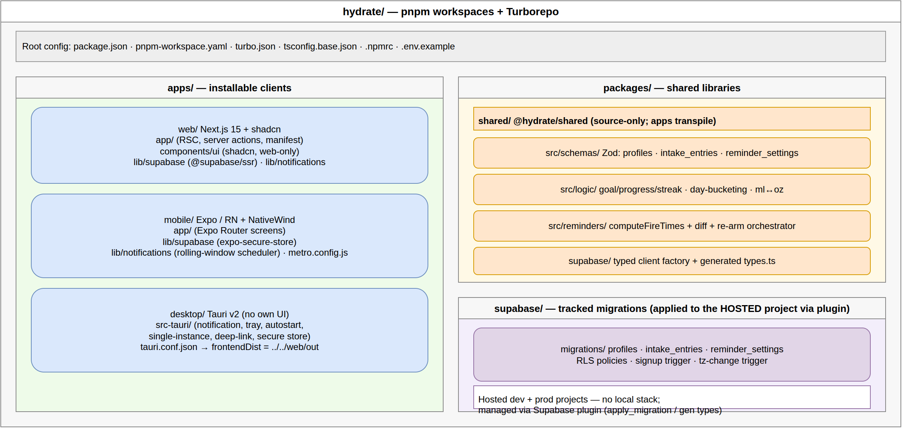
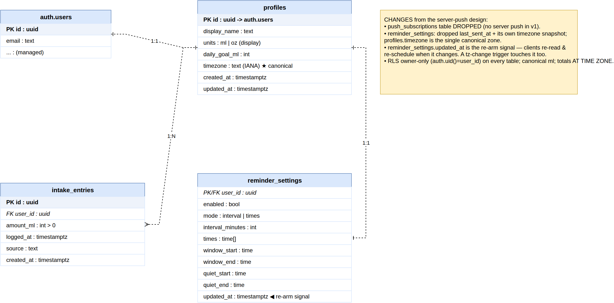
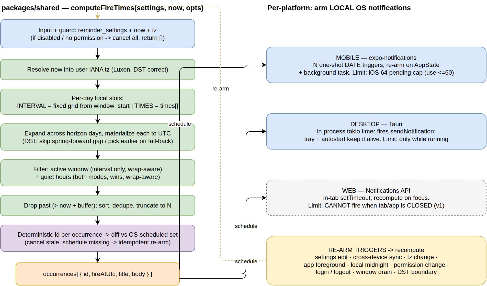
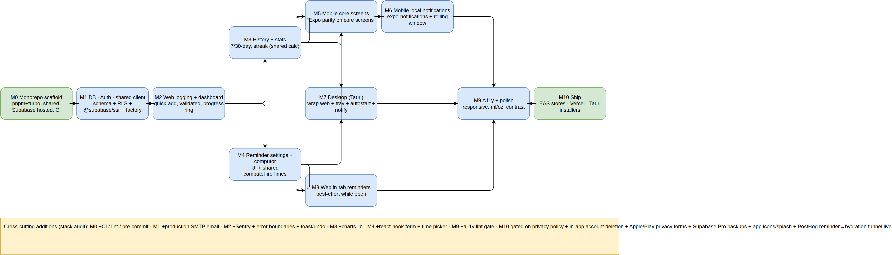
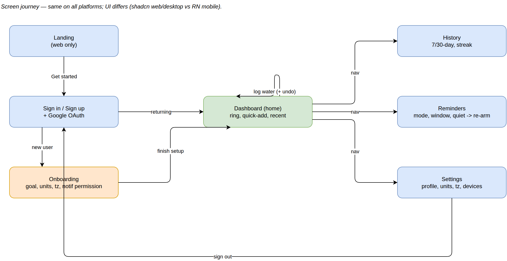

# Hydrate — Multiplatform Implementation Plan

Hydrate is a water tracker and reminder app shipping to **mobile (Expo/React Native, iOS+Android)**, **web (Next.js 15 PWA)**, and **desktop (Tauri wrapping the web build, Win/macOS/Linux)** from a single **pnpm + Turborepo** monorepo. Supabase provides **Postgres + Auth + RLS only** — there is no server cron, no Edge Function, and no web-push in v1. Reminders are **on-device local OS notifications**: the schedule lives server-side in `reminder_settings` so it syncs across a user's devices, and every client reads it, computes upcoming fire times with one shared, DST-correct algorithm, and arms its own local notifications using a **rolling window** that re-arms whenever the app opens or settings change. The hard parts — OS pending-notification caps, no forever-running process, timezone/DST correctness, and quiet hours/active windows — are solved once in `packages/shared` and consumed identically everywhere. This plan folds in the reminder design review's fixes directly (native repeating triggers for fixed times, honest drain/coverage UX, device-local timezone semantics, exact-alarm and quiet-hours guards).

---

## Diagrams

Visual companions to this plan, in [`diagrams/`](diagrams/) — each as an editable **`.drawio`**, a crisp **`.svg`**, and the embedded-XML **`.drawio.png`** shown here (open any `.drawio.png` in draw.io to edit).

### 1. System Architecture — three app shells over one shared core (no server push)


### 2. Monorepo Structure — pnpm + Turborepo layout


### 3. Data Model (ERD) — three tables; `push_subscriptions` dropped


### 4. Reminder Scheduling — on-device local notifications (`computeFireTimes` → per-platform arming → re-arm)


### 5. Build Roadmap — milestones M0–M10 with dependencies


### 6. User Flow — screen journey (same on all platforms; UI differs)


---

## 1) Overview & Goals

- **One product, three runtimes, maximal shared code.** Business logic, validation, the Supabase data layer, and the reminder scheduler are written once in `packages/shared`; only UI and platform glue (sessions, notifications, OAuth redirects) are per-platform.
- **Desktop reuses the web build verbatim** via Tauri — zero bespoke desktop screens — adding only tray, autostart, secure session storage, and a native notification bridge so reminders fire while backgrounded.
- **Correctness is non-negotiable:** Auth/RLS as the real authorization boundary, Zod validation everywhere, canonical milliliters, one IANA timezone per user, DST-correct scheduling, accessibility, and gesture-gated, non-nagging notification-permission UX.
- **Honesty about reliability limits.** Where a platform genuinely cannot deliver (web when closed; mobile after days of non-use; desktop while powered off), the app says so in-product rather than silently failing.

---

## 2) Targets & Stack

| Target | Stack | Why |
|---|---|---|
| **Shared** (`packages/shared`) | TypeScript: Zod schemas, pure domain logic (goal/progress/streak, ml↔oz, day-bucketing), reminder schedule computor, Supabase client factory + generated `Database` types. **Luxon** for all tz/DST math. | Single source of truth for rules; fully unit-testable in plain Node with zero platform imports. Luxon chosen over Temporal (still not broadly available in Hermes/browsers as of 2026). |
| **Mobile** | Expo (managed) + React Native + Expo Router + **NativeWind** + RN primitives (thin gluestack-ui slice for Sheet/Select/Switch). TanStack Query. `expo-secure-store` sessions. `expo-notifications`. **Forms:** react-hook-form. **Charts:** `victory-native` (pin `@shopify/react-native-skia`). **Time/date:** `@react-native-community/datetimepicker`. **Toasts:** `burnt`. **Icons:** `lucide-react-native`. | NativeWind mirrors web's Tailwind/shadcn token vocabulary, so design intent is shared with the least new API surface; Tamagui's compiler config and gluestack's heavier component layer aren't justified for v1's small screen set. |
| **Web** | Next.js 15 App Router + RSC + server actions + Tailwind + **shadcn/ui** (Radix). Auth via `@supabase/ssr` cookie sessions + middleware. TanStack Query for client interactivity. Installable PWA shell (no push). **Forms:** react-hook-form + `@hookform/resolvers/zod` (reusing shared Zod). **Charts:** Recharts (shadcn chart). **Toasts/undo:** `sonner`. **Icons:** `lucide-react`. **Dark mode:** `next-themes`. **Crash containment:** `error.tsx`/`global-error.tsx` + `react-error-boundary`. | RSC reads Postgres under RLS for instant first paint; shadcn is the canonical design system the desktop build inherits and mobile's tokens mirror. |
| **Desktop** | **Tauri v2** wrapping the `apps/web` static export. `tauri-plugin-notification`, `tauri-plugin-autostart`, tray + hide-to-tray, single-instance, deep-link plugin, secure session store (keyring/Stronghold or encrypted file). | Reuses 100% of web UI; the differentiator is a tray-resident process + autostart that fires native notifications while "closed," which plain web cannot do. |
| **Backend** | Supabase = **Postgres + Auth (GoTrue) + RLS only**. No pg_cron, no Edge Functions, no web-push/VAPID, no device push tokens. Optional Google OAuth. | Reminders are on-device, so there is nothing for the server to push. This deletes an entire failure/abuse surface (see §5). |
| **Observability** | **Sentry** (`@sentry/nextjs` web/desktop, `@sentry/react-native` mobile, Sentry Rust for `src-tauri`) + **PostHog** (`posthog-js`, `posthog-react-native`) for the reminder→hydration funnel. | A 3-runtime on-device scheduler is un-reproducible by a solo dev without remote traces; the "do reminders drive hydration?" thesis needs event analytics. Sentry plugin already connected. |
| **CI/CD & release** | **GitHub Actions** (turbo affected lint/typecheck/test/build) + Turborepo remote cache; **EAS Build/Submit** (mobile), **tauri-action** matrix (desktop), **Vercel** (web); **Changesets** versioning, **Renovate** deps. | Without CI every quality gate is advisory; release tooling makes cross-app versioning + signing repeatable. |

---

## Tooling & Operational Stack

Additions from the stack gap audit. The architecture is unchanged — these are the libraries, gates, and launch requirements the v1 build wires in. **must** = build/ship blocker; **should** = strong value, low cost. (Deferred items are in §13.)

**UI libraries (named so the screens can be built):**

| Need | Web / Desktop | Mobile | Tier |
|---|---|---|---|
| Forms + validation | react-hook-form + `@hookform/resolvers/zod` (shadcn Form) | react-hook-form + Controller | must |
| Charts (History/Stats) | Recharts (shadcn chart) | `victory-native` (+ `@shopify/react-native-skia`) | must |
| Time/date input | shadcn time-field → `HH:mm` | `@react-native-community/datetimepicker` | must |
| Toast + undo | `sonner` | `burnt` | must |
| Render-crash containment | `error.tsx` + `react-error-boundary` | top-level RN ErrorBoundary | must |
| Icons | `lucide-react` | `lucide-react-native` | should |
| Dark mode | `next-themes` | NativeWind `dark:` + `useColorScheme()` | should |

**Observability & analytics.** **Sentry** crash/error monitoring on all three runtimes, with source-map/debug-symbol upload wired into the Vercel/EAS/Tauri builds, events tagged by platform + version + reminder mode and PII scrubbed; **PostHog** with a consent-gated, canonical event set defined in `packages/shared` (`signup`, `onboarding_completed`, `permission_granted/denied`, `reminder_armed`, `reminder_opened`, `intake_logged`) to measure the reminder→tap→log funnel; Sentry **Release Health** + alert rules so a bad EAS/Tauri release is visible. *(Web Vitals via Vercel Speed Insights — should.)*

**CI/CD & release.** **GitHub Actions** running `turbo run lint typecheck test build` (affected-only) + Playwright + pgTAP/RLS as **required checks**; Turborepo **remote cache** + cancel-superseded concurrency; **EAS Build/Submit** (+ optional **EAS Update** OTA); **tauri-action** matrix (win/mac/linux) with signing/notarization certs in protected secrets; **Vercel** preview deploys; **Changesets** for one coordinated version + tags; **Renovate** for grouped Expo/Tauri/Rust updates; **gitleaks** secret scan.

**Store compliance & data (launch-gating).** Hosted **/privacy + /terms**; **Apple App Privacy** + **Play Data Safety** forms matching Supabase data flows; **in-app account deletion + data export** (Apple Guideline 5.1.1(v) requires the user-facing entry point in v1); **production transactional email** via Resend/Postmark SMTP + SPF/DKIM/DMARC (the built-in Supabase sender is rate-limited and not for production); **CAPTCHA** (Turnstile/hCaptcha) + tightened Auth rate limits + leaked-password protection; **Supabase Pro** for daily backups (decide PITR) — `intake_entries` is the irreplaceable source of truth.

**DX & ops.** Typed env validation (`@t3-oss/env-nextjs` + a Zod schema for `EXPO_PUBLIC_*`, fail-fast at boot); ESLint + Prettier (or Biome) with `eslint-plugin-jsx-a11y` / `-react-native-a11y`; **husky + lint-staged** (+ optional commitlint); Node/toolchain pinning (`.nvmrc` + `engines`); root `README`/`CONTRIBUTING` for the Metro/transpilePackages/hosted-Supabase setup; in-app **version surface**; app icon + splash pipeline (`expo-splash-screen`, adaptive icon, `tauri icon`).

---

## 3) Monorepo Structure

```
hydrate/
├─ package.json            # pnpm packageManager pin; thin `turbo run` scripts
├─ pnpm-workspace.yaml      # globs: apps/*, packages/*
├─ turbo.json              # build/dev/lint/typecheck/test; dependsOn ['^build']; env passthrough
├─ tsconfig.base.json      # path aliases: @hydrate/shared, @hydrate/shared/supabase
├─ .npmrc                  # node-linker + public-hoist patterns for RN/Expo/Metro
├─ .env.example            # canonical public env var names (no secrets)
├─ apps/
│  ├─ web/                 # Next 15 App Router + shadcn; ALSO the build desktop wraps
│  │  ├─ next.config.ts    # transpilePackages:['@hydrate/shared']; SSR vs output:'export' target flag
│  │  ├─ app/              # routes, RSC reads, server actions, manifest.ts, sw.js
│  │  ├─ components/ui/    # shadcn (web-only; never imported by mobile)
│  │  ├─ lib/supabase/     # @supabase/ssr clients + middleware (cookie sessions)
│  │  └─ lib/notifications/# in-tab Notifications API scheduler
│  ├─ mobile/              # Expo / RN + NativeWind
│  │  ├─ app.config.ts     # bundle ids, deep-link scheme, expo-notifications plugin
│  │  ├─ app/              # Expo Router screens
│  │  ├─ lib/supabase/     # expo-secure-store storage adapter
│  │  ├─ lib/notifications/# expo-notifications rolling-window scheduler
│  │  └─ metro.config.js   # watchFolders → repo root for pnpm resolution
│  └─ desktop/             # Tauri shell (no own UI)
│     └─ src-tauri/        # notification plugin, tray/autostart, single-instance, deep-link, secure store
│        └─ tauri.conf.json# frontendDist → ../../web/out; beforeBuildCommand runs web export
├─ packages/
│  └─ shared/              # @hydrate/shared (source-only; apps transpile)
│     ├─ package.json      # exports map: '.', './supabase', './reminders'
│     ├─ src/schemas/      # Zod: profiles, intake_entries, reminder_settings
│     ├─ src/logic/        # goal/progress/streak, day-bucketing, ml↔oz
│     ├─ src/reminders/    # computeFireTimes + diffSchedule + rearm orchestrator
│     └─ supabase/         # client factory + generated types.ts (never hand-edit)
└─ supabase/
   └─ migrations/          # tracked SQL — applied to the HOSTED project via the Supabase plugin
                           #   (profiles, intake_entries, reminder_settings, RLS, triggers)
```

**Wiring notes.** Path aliases live once in `tsconfig.base.json`; pnpm symlinks the package, so Next needs `transpilePackages:['@hydrate/shared']` and Expo needs Metro `watchFolders` to the repo root. A `gen:types` task generates `packages/shared/supabase/types.ts` from the **hosted** Supabase project via the Supabase plugin (`generate_typescript_types`, or `supabase gen types typescript --linked`); every app imports the `Database` type through `@hydrate/shared`, so migration → regenerate → typecheck surfaces drift across all three apps at once. Only public values reach clients (`NEXT_PUBLIC_*` for web/desktop build, `EXPO_PUBLIC_*` for mobile) — the project URL + **publishable/anon** key come from the plugin (`get_project_url`, `get_publishable_keys`); `packages/shared` never reads `process.env` directly — each app injects resolved config + a session-storage adapter into the client factory. No service-role key ships in any client bundle.

**Hosted Supabase — no local stack.** Development runs directly against a **hosted** Supabase project managed through the Supabase plugin (MCP): schema via `apply_migration`, types via `generate_typescript_types`, config via `get_project_url` / `get_publishable_keys`. There is **no** `supabase start` local Docker stack. Recommended: use a dedicated **dev** project separate from the **prod** project (or Supabase branching) so development never mutates production data — and never commit the service-role key.

---

## 4) System Architecture

The accompanying diagram shows three thin app shells over one shared core, with a single network egress to Supabase and no server→client push arrow.

- **`shared_client`** is the only thing that talks to Supabase. Each platform injects its own session-storage adapter (cookies / secure-store / Tauri store) into the factory; everything else stays platform-agnostic. App-path clients hold only the anon/publishable key, so **RLS scopes every row**.
- **`shared_domain`, `shared_schemas`, `shared_scheduler`** hold goal/progress/streak math, Zod validation, and the hard reminder-scheduling logic. Written once, consumed by web, mobile, and desktop.
- **Web** reads Postgres directly in RSC under RLS (instant first paint); writes go through server actions that re-call `getUser()` before mutating. Mobile and desktop read/write through the same shared query functions wrapped in TanStack Query hooks.
- **Desktop loads the web build outright** (`desktop_shell → web_app`), inheriting the web Supabase data path, so it draws no separate DB arrows. The embedded web build feature-detects Tauri and **bridges scheduling to the native notification plugin** instead of the browser Notifications API, so backgrounded reminders work.
- **No server push/cron.** `reminder_settings` is the synced source of truth: every client reads it (RLS-scoped), computes occurrences locally, and schedules its own OS notifications. There is intentionally no arrow from Supabase pushing anything to a client.

---

## 5) Data Model

Three tables, all owner-scoped, canonical **milliliters** everywhere (oz is display-only), one IANA timezone per user, daily totals bucketed `AT TIME ZONE` in Postgres.

**Kept**

- **`profiles`** — 1:1 with `auth.users` (auto-created by the signup trigger). `daily_goal_ml` (250–20000), `units` (`ml|oz`, display-only), `display_name`, `timezone` (IANA), timestamps.
- **`intake_entries`** — append-only ml log; source of truth for totals/history/streak. `amount_ml` (1–5000), `logged_at <= now()+5min`, `source` enum. Daily totals via a UTC-bounded, index-friendly range scan on `idx_intake_user_logged`, grouped `(logged_at AT TIME ZONE tz)::date`.
- **`reminder_settings`** — the **synced schedule source of truth** every client reads to arm its own local notifications. Columns: `enabled`, `mode` (`interval|times`), `interval_minutes` (15–1440), `times time[]`, `window_start/end`, `quiet_start/end`, `updated_at`.

**Dropped**

- **`push_subscriptions`** — removed entirely. v1 has no VAPID/web-push, no service-worker push subscriptions, no device tokens. Dropping it also deletes the globally-unique-endpoint-vs-owner-only-RLS footgun and its `SECURITY DEFINER` re-subscribe RPC.
- The **entire service-role reminder path**: `claim_due_reminders()`, `last_sent_at` stamping, `FOR UPDATE SKIP LOCKED`, dead-endpoint pruning, the send-reminders Edge Function, and the pg_cron/pg_net minute job. Service-role is retained only for a future account-deletion admin cascade.

**Changes (from the old push design)**

- **Drop `reminder_settings.last_sent_at`.** "Already fired / already scheduled" is now **per-device** state and lives locally (secure-store / IndexedDB / Tauri store). Promoting it to the synced row would let one device firing suppress every other device.
- **Drop the duplicate `reminder_settings.timezone` snapshot.** Read `profiles.timezone` as the single source so zones never drift between tables (see §7 for the device-local nuance).
- **Repurpose `updated_at` into the load-bearing re-schedule sync token.** Keep the `BEFORE UPDATE set_updated_at` trigger; clients store the `updated_at` they last armed from and compare to the server value to decide whether to cancel + re-arm. No separate `schedule_version` integer — a `timestamptz` is a sufficient comparable token for v1.
- **Add an `AFTER UPDATE OF timezone` trigger on `profiles`** that touches `reminder_settings.updated_at`, so a zone change bumps the single schedule token and forces every client to re-arm.
- **Add `CHECK (quiet_start <> quiet_end)`** (mirroring the existing `window_start <> window_end` CHECK). **Fix folded in:** without it, the wrap-aware quiet test `(t >= quiet_start OR t < quiet_end)` is always true when bounds are equal, silently suppressing every reminder. `computeFireTimes` also treats equal bounds as "no quiet hours" defensively.
- Keep all mode-consistency / quiet-pair-both-or-neither / window CHECKs — now **also** evaluated client-side via Zod. Keep **no client DELETE policy**; reset-to-defaults is an UPDATE; load via UPSERT so a missing row self-heals.

**RLS.** Enable RLS + default-deny on all three tables; explicit per-operation policies `TO authenticated` keyed on `auth.uid() = id` (profiles) / `auth.uid() = user_id` (intake_entries, reminder_settings). No client DELETE on profiles or reminder_settings. The reminder pipeline now has **zero** RLS-bypassing callers. Re-run Supabase advisors after dropping `push_subscriptions` to confirm no RLS-disabled user tables remain.

**Sync model.** Source of truth = `reminder_settings` (schedule) + `profiles.timezone` (server-side bucketing zone). `reminder_settings.updated_at` is the change token. Each client persists locally the `updated_at` it last armed from plus the set of occurrences it scheduled, and **re-arms** (cancel → recompute next N → schedule → save token) on: cold start; foreground/resume; a background tick; immediately after a local edit; and on a timezone change. Detection is a cheap `SELECT updated_at`: if the server token is newer or no live window remains, re-arm, else no-op. Per-device scheduling state is deliberately **not** synced. Supabase Realtime on the user's own row is an optional later that simply invokes the same re-arm function.

---

## 6) Auth

Supabase Auth (email/password primary + optional Google OAuth) with **PKCE everywhere**. RLS is the real authorization boundary; the service-role key never ships in any client. **Always `supabase.auth.getUser()` server-side / before any authorization decision** (it revalidates the JWT against the Auth server); `getSession`/`onAuthStateChange` are UI-state only.

| Platform | Session storage | OAuth redirect |
|---|---|---|
| **Web** | HttpOnly secure cookies via `@supabase/ssr` (`@supabase/ssr` handles chunking). Per-request server client built with a `getAll/setAll` cookie adapter (`setAll` wrapped in try/catch for RSC). Middleware `updateSession()` on every non-static request: build server client → `getUser()` immediately → guard protected routes → return the **same** response carrying rotated cookies. | Browser cookie callback: `signInWithOAuth({provider:'google', redirectTo:`${origin}/auth/callback`})` → `/auth/callback` exchanges `?code` via `exchangeCodeForSession`. Email confirm uses `token_hash` + `verifyOtp` (not the legacy fragment). |
| **Mobile** | `expo-secure-store` as the `auth.storage` adapter (`persistSession`, `autoRefreshToken`, `detectSessionInUrl:false`, `flowType:'pkce'`). AppState listener starts/stops `startAutoRefresh` on fg/bg. Mind SecureStore's ~2KB/value limit (chunk if needed). | Deep link via `expo-auth-session` + `expo-web-browser`: `makeRedirectUri({scheme:'hydrate', path:'auth/callback'})` → `openAuthSessionAsync` → `hydrate://auth/callback?code=...` → `exchangeCodeForSession`. `Linking` handles warm + cold starts. |
| **Desktop** | Reuses the web build but **not** webview cookies. Custom `SupportedStorage` adapter → Tauri commands writing to OS keychain (`tauri-plugin-keyring`/Stronghold) or an encrypted file. Same PKCE/auth opts as mobile; keeps the session valid while backgrounded so the tray app can re-arm. | Loopback `http://127.0.0.1:<ephemeralPort>/callback` (most portable) or the `hydrate://` scheme via deep-link plugin; system browser opens via `tauri-plugin-opener`; transient listener captures `?code` → `exchangeCodeForSession`. |

**Provisioning.** `AFTER INSERT ON auth.users` → `handle_new_user()` (`SECURITY DEFINER`, pinned `search_path`) atomically inserts the `profiles` row (`timezone DEFAULT 'UTC'`) **and** a self-consistent default `reminder_settings` row (`enabled=false, mode='interval', interval_minutes=60`) so CHECKs and NOT NULLs pass and signup can't break. Real IANA timezone is captured post-auth at onboarding via `Intl.DateTimeFormat().resolvedOptions().timeZone`, overridable in Settings.

**Redirect hygiene.** Every target — web origins (localhost/Vercel preview/prod), `hydrate://` (mobile + desktop), and `http://127.0.0.1` loopback — must be in both the Supabase Auth redirect allow-list and Google's authorized redirect URIs.

---

## 7) Reminders — On-Device Local Notifications

This is the core hard problem and the area where the design review demanded the most fixes. All fixes below are folded in.

### 7.1 The shared computor (`packages/shared/src/reminders`)

`computeFireTimes(settings, now, opts)` is a **pure, I/O-free, fully unit-testable** function. **Fix:** permission status is a platform async call, so `permissionGranted` is passed in via `opts` — the function never queries platform APIs.

1. **Guard.** If `enabled === false` OR `!permissionGranted` → return `[]` (signal caller to cancel everything).
2. **Resolve `now` into the target IANA zone** with Luxon (never manual offset math). Derive `localNow` and the current local date. All slot generation happens in wall-clock; only the final step converts to UTC.
3. **Per-day local candidate slots.** *Interval mode:* a grid anchored at `window_start`, stepping `interval_minutes` — anchoring prevents forward drift and makes the grid identical on every device/re-arm. *Times mode:* exactly the `times[]` entries for that day (see 7.2 — native repeating triggers, not one-shots).
4. **Expand across a dynamic horizon.** **Fix:** instead of a fixed small `H`, expand day-by-day until N occurrences are collected **or** a 365-day cap is hit. Sparse schedules (e.g. one fixed time/day) now fill the whole pending budget (~60 days of buffer) instead of draining in days; dense interval schedules are still bounded by N.
5. **Materialize each (localDate, slot) → UTC Instant** via IANA rules — the only place offsets apply. **DST:** spring-forward gap → skip (interval) or shift to next valid minute (fixed); fall-back overlap → pick the earlier instant so it fires once.
6. **Active-window filter — interval mode only** (fixed times bypass it: the user named the exact time). Half-open `[start, end)`, **wrap-aware** for windows crossing midnight. **Fix:** the wrapping grid (e.g. 20:00–02:00) is generated as one continuous sequence of length `((end - start + 1440) mod 1440)` minutes from each `window_start`, attributing each slot to exactly one logical window instance — no seam duplication or 2h gap. Unit-tested with intervals that don't divide the window evenly.
7. **Quiet-hours filter — both modes; quiet wins** over window and over fixed times. Only active when both bounds are non-null and unequal. Half-open, wrap-aware for the common 22:00–07:00. UI warns at save-time when a fixed time lands in quiet hours rather than silently dropping it.
8. **Drop the past:** keep `fireAtUtc > now + leadBufferSec`. **Fix:** keep an imminent-but-still-future occurrence rather than permanently filtering it, so frequent foregrounding right before a slot doesn't systematically skip the soonest ping (web re-arms a short in-tab timer for it).
9. **Sort, dedupe, truncate to N** within the horizon (N per-platform; iOS ≤ ~60 for headroom under the 64 cap).
10. **Deterministic id per occurrence.** **Fix:** key on `userId + epochMinuteUtc + a content/`updated_at` hash` (and a slot index if sub-minute distinct occurrences are possible). Deterministic ids make re-arm idempotent — read the OS's scheduled set, diff by id, cancel stale, schedule only missing — and the content hash forces cancel+reschedule when copy changes at the same minute. Returns `[{id, fireAtUtc, fireAtLocal, title, body, payload:{url:'/dashboard', tag:'hydrate-reminder'}}]`.

`diffSchedule(desired, pending) → {toSchedule, toCancel}` plus a platform-agnostic `rearm(settings, scheduler)` orchestrator drive an injected `NotificationScheduler` port (`schedule / cancelAll / getPending`).

### 7.2 Fixed "times" mode uses native repeating triggers (key fix)

**Fix (launch-blocking):** for `times` mode, use OS-native **repeating CALENDAR/DAILY triggers** (one per `HH:mm`) instead of one-shot DATE triggers. This (a) consumes one pending slot per time *forever* instead of N copies, hugely relieving the 64 cap; (b) **never drains**, eliminating the disengaged-user gap for fixed mode; (c) is recomputed in the device's current wall-clock by the OS each day, so it stays **correct across DST automatically** without re-arm. One-shot grids are reserved for **interval mode**, where active-window/quiet-hours genuinely require per-slot generation; the idempotent diff applies to those one-shots plus the small set of repeating triggers.

### 7.3 Per-platform scheduling

| Platform | API | How scheduled | Honest limits (surfaced in-app) |
|---|---|---|---|
| **Mobile** | `expo-notifications`. Permissions gesture-gated. Interval = DATE one-shots; fixed = CALENDAR repeating. Android channel `reminders` set **importance HIGH**. Re-arm via AppState `active` + `expo-background-task`. | Recompute → `getAllScheduledNotificationsAsync` → diff by id → cancel stale + schedule missing (idempotent). | iOS **64 pending cap** (extras silently dropped) → keep N ≤ ~60. **Fix:** background refresh is least likely to run for users who stopped opening the app, so the window can drain in 1–3 days — surfaced as in-app copy ("open occasionally to keep reminders scheduled"), and fixed mode uses repeating triggers that never drain. **Fix:** decide exact vs inexact alarms — request `SCHEDULE_EXACT_ALARM` (API 31+) + `setExactAndAllowWhileIdle` for on-time delivery, and prompt to disable battery optimization on aggressive OEMs (Xiaomi/Huawei/OnePlus/Samsung). **Fix:** check **channel-level** enablement (Android 13+ can mute the channel while app permission shows granted); decide iOS provisional auth explicitly. "Delivered even when killed" softened — Force Stop / OEM killers cancel alarms. |
| **Desktop** | `@tauri-apps/plugin-notification` (fires immediately only — no OS future-scheduling primitive). In-process Rust scheduler (tokio timer) holds the next instant; `tauri-plugin-autostart` + tray + single-instance keep it alive; persist the computed window to disk. | Compute next N → persist → arm timer to soonest → on fire, advance + top up. Cold launch loads persisted times, drops past, re-arms forward. | Fires only while the process is alive (tray/background). Machine off or app fully quit = missed (re-arm forward, no backfill). **Fix:** add an **OS resume/wake hook + periodic self-heal tick** (every few minutes) — the single tokio timer doesn't advance during suspend, and resume isn't a cold launch, so without this the soonest reminder goes stale or all missed ones fire at once. macOS needs permission + signed/notarized bundle; Linux needs a running notification daemon. |
| **Web** | Notifications API (`requestPermission` gesture-gated; `registration.showNotification` preferred). No reliable scheduling primitive (Notification Triggers is Chromium-experimental, not relied upon) → in-tab `setTimeout` keyed to fire times, recomputed on `visibilitychange`/focus. BroadcastChannel leader election to avoid duplicate firing across tabs. | While the tab is open: arm timers for the next handful; on visibility/focus, clear + recompute. | **Cannot fire when the tab/browser is closed in v1.** **Fix (launch-blocking):** a **persistent, prominent banner on the Reminders screen** tells the *user* (not just the design doc): "Reminders only fire while Hydrate is open in a browser tab. Install the mobile or desktop app for background reminders." Detect installed-PWA vs plain tab and adjust copy. Background tabs throttle/coalesce timers (≥1 min) — best-effort only, never the primary channel. |

### 7.4 Rolling window & re-arm

**Two constraints:** OSes cap pending notifications (iOS 64), and no client runs forever. **Solution = sliding buffer + idempotent re-arm.** Each client schedules only the next N within the dynamic horizon; ids are deterministic so re-running re-arm is a no-op when nothing changed and never double-alerts; the window is topped up on every re-arm trigger; and on reopen after days closed, long-past occurrences are **dropped with no backfill burst** and the window re-arms forward only.

**Buffer-depth honesty (fix).** N does **not** map to a flat 48–96h horizon. With `interval_minutes=15` and a 16h window, that's 64 slots/day, so N=60 buys **< 1 day**. The Reminders UI **computes and displays actual buffer depth** (`interval × window × N`) and **warns when settings yield < 24h** of buffer ("open the app daily to keep reminders firing"). Per-platform N is documented against worst-case interval, not a false flat promise.

**Re-arm triggers:** app cold-start/open; foreground/resume (RN AppState `active`, Tauri window-focus/tray-restore + resume-from-suspend, web `visibilitychange`/focus); background tick (mobile BGTask, desktop tokio timer); **next foreground after local midnight** (reworded — a mobile in-process midnight timer can't fire while killed, but tomorrow's slots are already materialized); immediately after a local edit (optimistic re-arm); remote `updated_at` change; timezone change; permission grant/revoke (revoke → cancel all + non-nagging re-enable CTA); auth login/logout (logout cancels all pending).

### 7.5 Timezone semantics (fix — resolve the contradiction)

**Decision:** compute reminders in the **device's current OS zone** (`Intl.DateTimeFormat().resolvedOptions().timeZone`) — users expect reminders in local wall-clock wherever they are. `profiles.timezone` is kept **solely for server-side daily-total bucketing** and is **not** auto-overwritten by a traveling device. This removes the ping-pong loop where two devices in different physical zones each detect a mismatch and overwrite the canonical zone, re-triggering each other. (The user can still set their bucketing/home zone explicitly in Settings.)

### 7.6 Multi-device duplicates (fix)

Deterministic logic means phone + desktop + open web tab fire the same slot simultaneously — exactly the friction that makes users disable reminders. **Ship the per-device enable toggle in v1** (purely local state, cheap); default secondary devices (desktop/web) to **off**, or let the user pick a primary reminder device.

---

## 8) Screens & UX

**Shared logic, separate UI.** All goal/progress/streak/stats math, Zod validation, DB types, the Supabase client, and the reminder computor live in `packages/shared`. UI is **not** shared between web (shadcn) and mobile (NativeWind); desktop is the web UI verbatim.

| Screen | Mobile (Expo Router) | Web (App Router) | Desktop |
|---|---|---|---|
| Auth | sign-in/up tabs, email+password + optional Google | `/sign-in`, `/sign-up` | inherits web |
| Onboarding | goal, units, auto-detected IANA tz, enable-reminders permission gate | same | inherits web |
| Dashboard | radial ring + remaining, quick-add 250/500/750 + custom, recent entries with undo, streak badge | `/dashboard`, accessible SVG ring (aria-valuenow/min/max + text fallback), optimistic update + `revalidatePath` | inherits web + tray quick-add |
| History/Stats | 7/30-day bars + goal line, total, average, streak | `/history` | inherits web |
| Reminders | interval vs fixed, active window, quiet hours, enable, **buffer-depth + web-only/limit banners**, send-test, per-device toggle | `/reminders` (same, with the **open-tab-only banner**) | inherits web + native bridge |
| Settings | display name, email (read-only), units, goal, timezone, sign out | `/settings` | inherits web |

Navigation: mobile bottom tabs `[Dashboard | History | Reminders | Settings]` (Auth/Onboarding pre-tab); web sidebar on md+ collapsing to a bottom/top bar on small screens; desktop adds a **system tray menu** (quick-add 250/500/750, Open, Pause reminders, Quit) and optional compact quick-add popover. Accessibility is never cut: keyboard paths, AA contrast, `prefers-reduced-motion` disables ring animation, RN `accessibilityLabel/role/value`, defined loading/empty/error states per route, and gesture-gated, non-nagging permission UX consistently across all three platforms (including the desktop/macOS denied state and web denied state, not just mobile).

---

## 9) Build Roadmap

| Phase | Goal | Key acceptance |
|---|---|---|
| **M0 — monorepo-scaffold** | pnpm + Turborepo with web/mobile/desktop + `packages/shared` as buildable stubs; hosted Supabase (dev) project connected via the plugin; green gates. | `pnpm turbo run build lint typecheck` exits 0; plugin reaches the project (`list_projects`/`list_tables` returns) and project URL + anon key resolve; web `/` 200, mobile boots, `tauri dev` opens loading web; a shared exported fn resolves in web + mobile. |
| **M1 — db-auth-shared-client** | Schema (3 tables), all CHECKs (incl. **`quiet_start <> quiet_end`**), RLS, `handle_new_user`, generated types, client factory, Zod. `push_subscriptions` never created. | Migrations clean; advisors show RLS on all 3 tables; signup creates exactly one profile + one valid `reminder_settings`; user-B cannot CRUD user-A rows; Zod bounds match SQL CHECKs at edges (14/15/1440/1441, 0/1/5000/5001); factory builds for web + RN. |
| **M2 — web-logging-dashboard** | `@supabase/ssr` cookie auth + middleware; onboarding captures real IANA tz; quick-add server actions; live ring. | Unauth protected route 302s; session survives reload; quick-add optimistic then reconciles, rejects ≤0/>5000; daily total matches SQL across a tz-boundary fixture. |
| **M3 — history-stats-shared-calc** | DST-correct `bucketByLocalDay`, `computeStreak`, 7/30-day aggregates in shared; web History. | Buckets correct across a DST+midnight fixture; streak counts/resets; deleting an entry updates day total + ring; shared calc runs in Node Vitest with zero RN/DOM/Tauri imports. |
| **M4 — reminder-settings + computor** | Web Reminders UI writes `reminder_settings`; the pure `computeFireTimes` + `diffSchedule` + re-arm contract + **buffer-depth display**. No notifications fired yet. | Settings persist/reload + RLS-scoped; validation rejects equal window, empty `times[]`, half-set quiet, **equal quiet**; computor unit tests: interval grid + window + quiet wrap (incl. **20:00–02:00 seam**), fixed same-day, **DST fall-back once / spring-forward next-minute**, exact N cap, new-user first occurrence; computor pure (no platform imports). |
| **M5 — mobile-core-screens** | Expo parity: auth, onboarding, dashboard/log, history, reminder settings; secure-store sessions; OAuth deep links. | Sign-in/up on iOS sim + Android emu; session survives cold start; Google deep link round-trips; ring/history match web for same data; editing settings on mobile visible on web. |
| **M6 — mobile local notifications** | `expo-notifications` rolling window: interval one-shots + **fixed repeating triggers**, channel HIGH, exact-alarm/battery prompts, re-arm engine. | New user gets first interval reminder; quiet/disabled gets none; edit re-arms (verified via `getAllScheduledNotificationsAsync`); pending count never exceeds cap; fixed fires at named local time; simulated DST + device-tz change re-derive correctly. |
| **M7 — desktop Tauri** | Wrap web build + tray + autostart + notification plugin + **resume/self-heal tick**; secure session; deep-link OAuth. | `tauri build` runs loading web UI; minimizes to tray, close keeps process alive, tray quit exits; autostart registers; reminder fires while hidden (~1–2 min out) and after suspend/resume; OAuth persists across restart; schedule identical to web/mobile (no logic fork). |
| **M8 — web in-tab reminders** | Best-effort Notifications API while open, shared computor, **honest closed-tab banner**, cross-tab dedupe. | Due reminder shows at correct local time; quiet/disabled suppressed; edit re-arms timers; UI clearly states open-tab-only; reuses shared computor (no web-only schedule logic). |
| **M9 — a11y-polish** | a11y, responsiveness, ml/oz consistency, permission UX, loading/empty/error states across web + mobile (desktop inherits web). | axe/Lighthouse no critical violations on web; mobile passes inspector + VoiceOver/TalkBack smoke; unit toggle updates every displayed amount; reduced-motion disables ring animation both platforms. |
| **M10 — ship** | Web→Vercel, mobile→EAS (TestFlight/Play), desktop→signed installers, against Supabase Cloud. | Prod web 200 + login + logged amount in history; iOS/Android install and fire a local reminder on device; signed installers run on Win/macOS/Linux with a backgrounded reminder firing on ≥1 signed build (macOS notarized); advisors report no RLS-disabled user tables. |

Dependencies: M0→M1→M2→M3; M4 after M2; M5 after M3+M4; M6 after M5; M7 after M3+M4; M8 after M4; M9 after M6+M7+M8; M10 after M9.

**Cross-cutting additions (from the stack audit — see Tooling & Operational Stack):** **M0** also stands up **CI (GitHub Actions)**, lint/format, and pre-commit hooks; **M1** wires **production SMTP** for auth email; **M2** adds **Sentry** + error boundaries + toast/undo; **M3** adds the **charting** library; **M4** adds **react-hook-form** + the time picker; **M9** adds the a11y lint gate; **M10** is additionally gated on **privacy policy, in-app account deletion, Apple/Play privacy forms, Supabase Pro backups, app icons/splash, and the PostHog reminder→hydration funnel being live.**

---

## 10) Testing

Layered, shared-first, and **CI-enforced** — GitHub Actions runs every gate below on each PR as a required check (see **Tooling & Operational Stack**). Mobile uses `jest` + `jest-expo`; shared/web use Vitest.

1. **Static gates** every change: `tsc --noEmit`, ESLint (+ `jsx-a11y` / `react-native-a11y`), Prettier via turbo across all packages.
2. **Unit (Vitest) on `packages/shared`** — the highest-value suite because all three platforms reuse it: tz day-bucketing, streak, ml↔oz, and especially `computeFireTimes` — interval grid + active window + **wrap-aware quiet hours** + the **20:00–02:00 seam**, fixed-times same-day catch-up, **DST fall-back (no duplicate) / spring-forward (no skip)**, new-user first occurrence, **dynamic horizon fills the budget**, and exact N cap.
3. **RLS/security** via pgTAP or set-role/JWT sessions: user B cannot CRUD user A's `profiles`, `intake_entries`, `reminder_settings`.
4. **Integration** for web server actions (validation bounds, auth required, correct UTC-bounded daily totals) against the hosted Supabase (dev) project.
5. **Per-platform re-arm tests:** assert `cancelAll`-then-schedule produces exactly the computor's next N (inspect `getAllScheduledNotificationsAsync` on mobile; the Tauri loop and in-tab timers on web); assert fixed mode uses repeating triggers.
6. **One Playwright web E2E:** signup → log → ring updates → 7-day stats → save reminder settings.
7. **a11y:** Lighthouse/axe + installability on web; accessibility-inspector + VoiceOver/TalkBack smoke on mobile.
8. **Manual real-device notification smoke** (emulators can't fully cover): installed iOS, Android, and a signed desktop build each firing a reminder while backgrounded, plus a DST/timezone-change re-arm check and a desktop suspend/resume check.
9. **Component tests** — Testing Library (`@testing-library/react` web, `@testing-library/react-native` mobile) with **MSW** stubbing Supabase REST/Auth: optimistic quick-add reconcile/rollback, reminder-settings validation rendering, and the accessible ring's value + text fallback.
10. **Mobile E2E (Maestro)** — one happy path on the primary reminder platform: sign-in → log → ring → save reminder → cold-restart.
11. **Deterministic time/timezone harness** — `vi.useFakeTimers()` + Luxon `Settings.now`/`defaultZone`, with a CI timezone matrix (e.g. `America/New_York` + `Pacific/Auckland`) so non-pure `rearm()`/in-tab-timer/`Intl` code isn't validated only in the runner's zone.
12. **Coverage floor** — ~90% branch coverage gate on `packages/shared/reminders` only (the DST/quiet-hours/window branch matrix).

---

## 11) Deployment

All against one Supabase Cloud project. **Ship order: Supabase migrations → web (the build desktop wraps) → desktop installers + mobile store submissions.**

- **Supabase:** apply migrations to the hosted **prod** project via the plugin (`apply_migration`) or `supabase db push --linked`; confirm advisors report RLS on all three tables; set Auth Site URL + redirect allow-list covering web (localhost, Vercel preview + prod), the `hydrate://` deep-link scheme (mobile + desktop), and `http://127.0.0.1` loopback; add Google OAuth redirects in both Supabase and Google Cloud. No pg_cron, no Edge Functions, no VAPID/web-push secrets.
- **Web → Vercel:** project with `NEXT_PUBLIC_SUPABASE_URL` + `ANON_KEY` (Production + Preview); optional PWA manifest; never expose service-role; prod smoke test.
- **Mobile → EAS:** `eas build` + `eas submit` for iOS (TestFlight → App Store) and Android (Play internal → production); app config for custom scheme, notification permissions/entitlements (incl. exact-alarm justification), icons, store listings, and permission/privacy disclosures (clear copy that reminders are **on-device local notifications, no server push**); separate preview vs prod channels.
- **Desktop → Tauri bundler:** per-OS installers (NSIS/MSI on Windows, `.dmg`/`.app` on macOS, AppImage/`.deb` on Linux) with **Windows code signing** and **macOS signing + notarization** in the bundle step; register autostart; optional auto-updater; document the unsigned-Linux path.
- **Email (launch-gating):** production transactional email via **Resend/Postmark** SMTP with SPF/DKIM/DMARC and customized Supabase Auth templates — the built-in sender is rate-limited and not for production.
- **Observability:** wire **Sentry** source-map/debug-symbol upload into the Vercel, EAS, and Tauri build steps; initialize **PostHog** on all three clients (shared event names); enable Sentry Release Health + alert rules.
- **Compliance & data (launch-gating):** host **/privacy + /terms** on the web app; complete **Apple App Privacy** + **Play Data Safety**; ship **in-app account deletion + data export**; run prod on **Supabase Pro** for daily backups; add **gitleaks** secret scanning, CAPTCHA, and tightened Auth rate limits.
- **Release discipline:** version alignment across all apps (via **Changesets** + CI; see **Tooling & Operational Stack**) and a rollback plan (revert Vercel deploy, re-submit prior EAS build, re-publish prior signed installer).

---

## 12) Risks & Mitigations

- **App-store review** (thin content, background-notification justification, permission rationale): ship to TestFlight/internal early, write clear permission copy, keep logging fully usable without notifications, and prepare review notes explaining on-device local reminders (no server push).
- **iOS 64 pending cap + no forever process:** the rolling-window computor schedules only the next N (< cap) and re-arms on open/foreground/background; **fixed mode uses repeating triggers** that never count against drain.
- **Disengaged-user drain** (background refresh least likely to run when most needed): repeating triggers for fixed mode; dynamic horizon fills the budget for sparse schedules; honest in-app copy; consider a low-importance keep-alive nudge.
- **Android Doze / inexact alarms / OEM killers:** decide exact vs inexact explicitly, request `SCHEDULE_EXACT_ALARM`, prompt to disable battery optimization on aggressive OEMs; document best-effort delivery; don't overstate kill-survival.
- **Tauri webview/OS quirks** (WebView2 vs WebKitGTK vs WKWebView): route notifications through the Tauri plugin (not the web API) under Tauri, use deep-link + single-instance plugins for OAuth, add a resume/self-heal tick, smoke-test each OS before release.
- **Two-UI drift** (shadcn vs NativeWind): all rules (progress/streak/stats, computor, Zod, DB types, client) live only in `packages/shared`; UI layers are thin and token-aligned.
- **OAuth deep-link misconfig:** PKCE everywhere, client-side `exchangeCodeForSession`, schemes registered per platform, every redirect URI in Supabase + Google allow-lists (incl. Vercel preview/prod).
- **DST/timezone correctness:** computor is DST-aware (fall-back once, spring-forward next-minute), interval grid is anchored, fixed mode uses OS-recomputed repeating triggers, re-arm fires on device-tz change; device-local semantics removes the cross-device ping-pong.
- **Cross-device settings staleness:** `reminder_settings` is the single source of truth; clients re-fetch + re-arm on foreground and on `updated_at` change.
- **Secure session storage per platform:** pluggable adapter behind the shared client; secure-store/keyring/Stronghold or encrypted file on desktop, never plaintext.
- **Desktop signing/notarization friction:** budget certs early, automate notarization in the bundler step, document the unsigned-Linux path.
- **Supabase free-tier limits:** no server cron needed (reminders on-device); keep schema lean, monitor usage, treat a paid upgrade as a documented later.

---

## 13) Out of Scope / Later

- **Server web-push** (VAPID, service-worker push, device tokens) — the only way web fires when closed; would re-introduce `push_subscriptions` and a server send path. Documented "later," surfaced to web users today via the open-tab-only banner.
- **Supabase Realtime** on the user's own `reminder_settings` row for instant cross-device re-arm — would invoke the same re-arm function; ensure the publication enforces owner-only RLS.
- **pg_cron / Edge Functions / any server-side scheduling** — intentionally absent in v1.
- **Account-deletion cascade internals** — post-v1, but the **user-facing delete + data-export entry point ships in v1** (Apple Guideline 5.1.1(v); see **Tooling & Operational Stack**).
- **A monotonic `schedule_version`** counter — only if a future Realtime path needs clock-skew-proof ordering; `updated_at` suffices for v1.
- **Auto-updater for desktop**, richer stats/insights, social/streak sharing, and Android widget/keep-alive nudges — nice-to-haves beyond the v1 core.
- **PostHog session replay** — heavyweight + privacy-sensitive; enable web-only later once funnels reveal drop-off.
- **External uptime / synthetic monitoring** (BetterStack/Checkly) — low value over Vercel/Supabase status; set Supabase usage/billing alerts for now.
- **Desktop E2E** (tauri-driver/WebdriverIO) — no macOS support, flaky for tray/suspend; lean on shared-computor tests + a small Rust self-heal unit test.
- **Dedicated staging environment** — per-PR Vercel previews suffice for v1.
- **Feature flags / remote config** — a Supabase config row + a "min supported version" check is enough until complexity justifies PostHog/Statsig.
- **Haptics** (`expo-haptics`) and **EAS Update OTA** — optional polish / hotfix-latency wins, safe to defer.